支持在 Android、Windows、Linux、Macox、ios（ios需要自签名安装）上运行。

~~flutter也可在hmos上运行，但是懒得编译~~

<div>

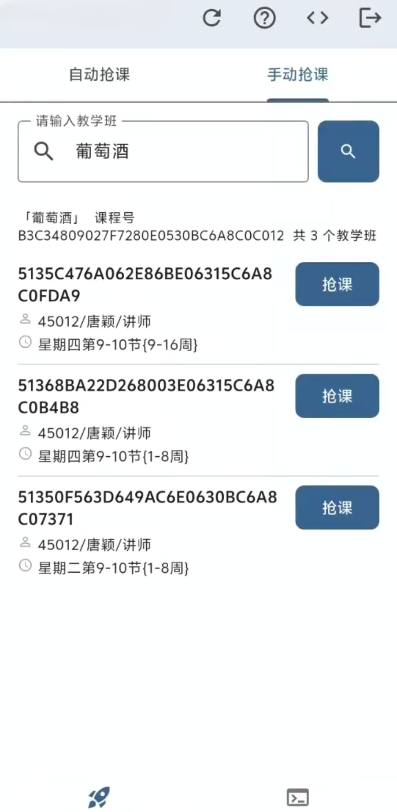
</div>

## 使用条件

## 下载

Github 下载地址：https://github.com/mcitem/lnu_elytra/releases

### 安卓

| 安卓手机下载                                                   |
| -------------------------------------------------------------- |
| https://oss.mcitem.net/archive/lnuElytra/lnu_elytra-v1.0.3.apk |

安装过程中，若出现如上图所示拦截，请先【勾选】已了解选项后，点击【继续安装】即可完成。

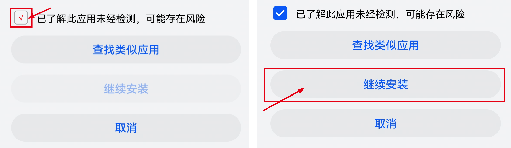

## 电脑

| Windows电脑下载                                                 |
| --------------------------------------------------------------- |
| https://oss.mcitem.net/archive/lnuElytra/v1.0.3/windows-x64.zip |

下载后，需要先全部解压缩后才能运行`lnu_elytra.exe`

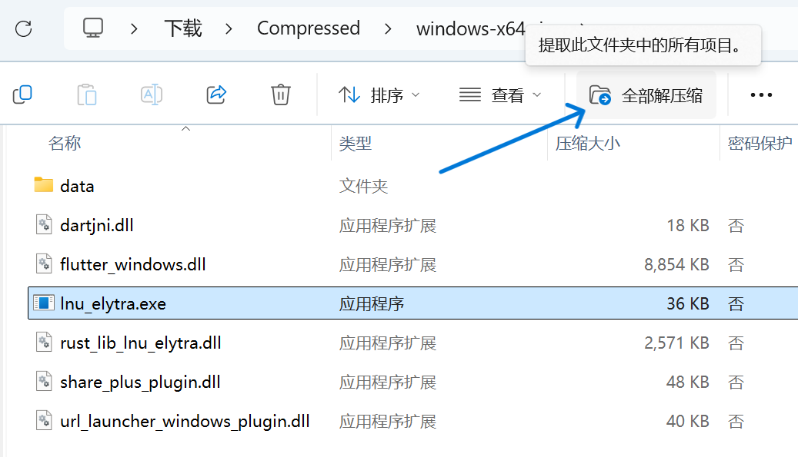

## Linux

| Linux下载                                                        |
| ---------------------------------------------------------------- |
| https://oss.mcitem.net/archive/lnuElytra/v1.0.3/linux-x64.tar.gz |

```sh
wget https://oss.mcitem.net/archive/lnuElytra/v1.0.3/linux-x64.tar.gz

tar -xzvf linux-x64.tar.gz
chmod +x ./lnu_elytra
./lnu_elytra

```

## Macos

| Macos下载                                                    |
| ------------------------------------------------------------ |
| https://oss.mcitem.net/archive/lnuElytra/v1.0.3/macos.tar.gz |

```sh
tar -xzvf macos.tar.gz
chmod +x ./lnu_elytra.app/Contents/MacOS/*
xattr -cr ./lnu_elytra.app
./lnu_elytra.app/Contents/MacOS/lnu_elytra
```

## ios

| ios下载                                                 |
| ------------------------------------------------------- |
| https://oss.mcitem.net/archive/lnuElytra/v1.0.3/ios.ipa |

ios 需要用爱思助手Apple ID 自签名安装

【爱思助手 使用 Apple ID 对 IPA 安装包签名的详细操作教程！】 https://www.bilibili.com/video/BV1Jg4y1n7hi

<div style="width:100%; height:500px; overflow:hidden; border-radius:8px;">
  <iframe 
    src="//player.bilibili.com/player.html?isOutside=true&aid=822836576&bvid=BV1Jg4y1n7hi&cid=1033272415&p=1" 
    scrolling="no" 
    border="0" 
    frameborder="no" 
    framespacing="0" 
    allowfullscreen="true"
    style="display:block; width:100%; height:100%; border:0; padding:0; margin:0;">
  </iframe>
</div>

## 其他下载

| 其他下载                                                                         |
| -------------------------------------------------------------------------------- |
| https://oss.mcitem.net/archive/lnuElytra/v1.0.3/app-x86_64-release.apk           |
| https://oss.mcitem.net/archive/lnuElytra/v1.0.3/app-x86_64-release.apk.sha1      |
| https://oss.mcitem.net/archive/lnuElytra/v1.0.3/app-release.apk.sha1             |
| https://oss.mcitem.net/archive/lnuElytra/v1.0.3/app-release.apk                  |
| https://oss.mcitem.net/archive/lnuElytra/v1.0.3/windows-x64.zip                  |
| https://oss.mcitem.net/archive/lnuElytra/v1.0.3/macos.tar.gz                     |
| https://oss.mcitem.net/archive/lnuElytra/v1.0.3/ios.ipa                          |
| https://oss.mcitem.net/archive/lnuElytra/v1.0.3/linux-x64.tar.gz                 |
| https://oss.mcitem.net/archive/lnuElytra/v1.0.3/app-arm64-v8a-release.apk        |
| https://oss.mcitem.net/archive/lnuElytra/v1.0.3/app-arm64-v8a-release.apk.sha1   |
| https://oss.mcitem.net/archive/lnuElytra/v1.0.3/app-armeabi-v7a-release.apk      |
| https://oss.mcitem.net/archive/lnuElytra/v1.0.3/app-armeabi-v7a-release.apk.sha1 |

# 使用方法

## 登录

本项目未适配需要验证码的登录，如果你所在学校的系统存在登录页面常驻验证码（如 [广州理工学院](https://jw.gzist.edu.cn/jwglxt/xtgl/login_slogin.html) 你只能使用Cookie登录方式

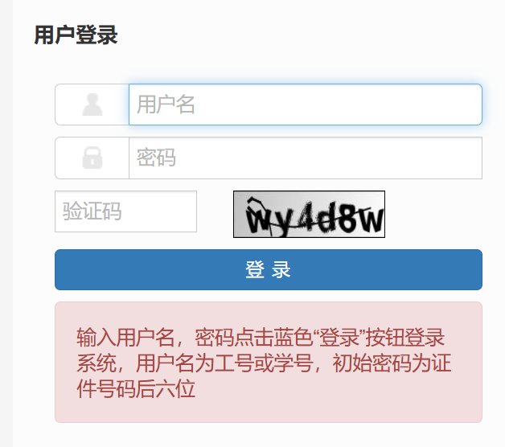

## 登录地址

登录前你需要点击"正在访问：xxx"，选择预设的学校或者输入你学校的教务系统地址

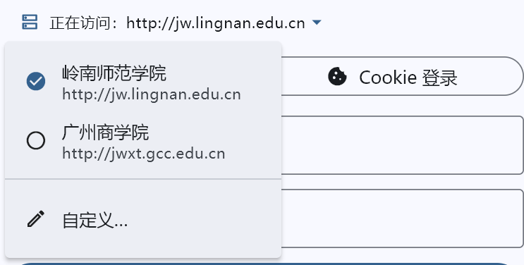

用浏览器打开你学校的教务系统登录页面

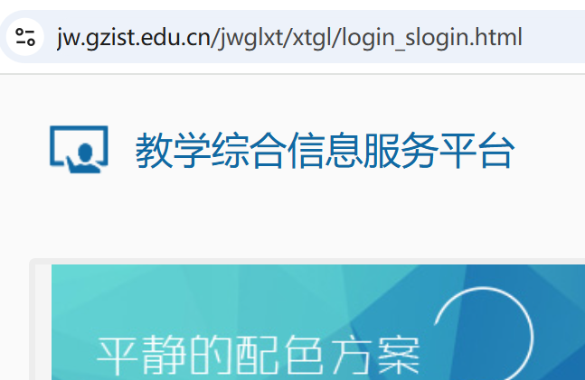

全选地址栏复制，并粘贴到自定义地址输入框内即可

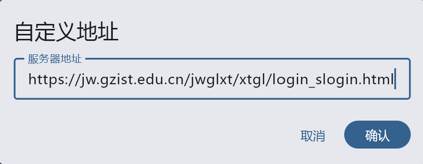

如果此方法依旧登录不了，就尝试手动删除`xtgl/login_slogin.html`及以后的字符

使用：`https://jw.gzist.edu.cn/jwglxt/` 作为登录地址

注意末尾`/`字符不可省略

## 账号密码登录

本项目未适配需要验证码的登录，如果你所在学校的系统存在登录页面常驻验证码（如 [广州理工学院](https://jw.gzist.edu.cn/jwglxt/xtgl/login_slogin.html) 你只能使用Cookie登录方式

账号密码必须是正方系统本身的密码如果你的学校只支持网上办事大厅授权登录，你也只能用cookie登录方式。

## Cookie登录（推荐优先使用

以Edge浏览器为例

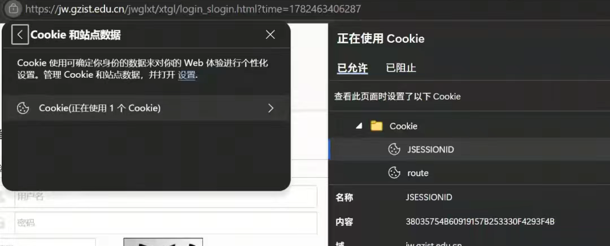

在抢课开始前10分钟左右（cookie有时效性不要太早登录，cookie可能会过期），先在浏览器中正常登录教务系统，然后在地址栏找左上角这个小锁，里面的cookie, 把名称、内容复制出来，拼接到这个模板上就行了.

格式：`名称1=内容1; 名称2=内容2;` 必须是英文分号，填错登录不了

例如：Cookie模板： `JSESSIONID=XXX; route=YYY;`

不同学校的cookie**名称**、**内容**可能有区别

例如有的是`JSESSIONID=XXX; zstack_cookie=YYY;`

有的则是`JSESSIONID=XXX; X-LB=YYY;`

以实际为准。

### 手机端获取cookie

在手机端你可以通过via浏览器快速拿到cookie

via下载： https://viayoo.com/zh-cn/

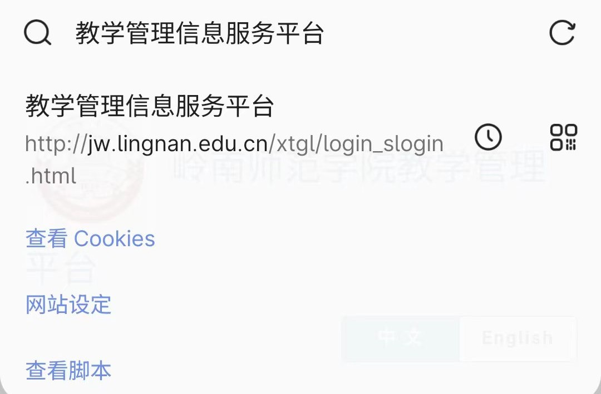
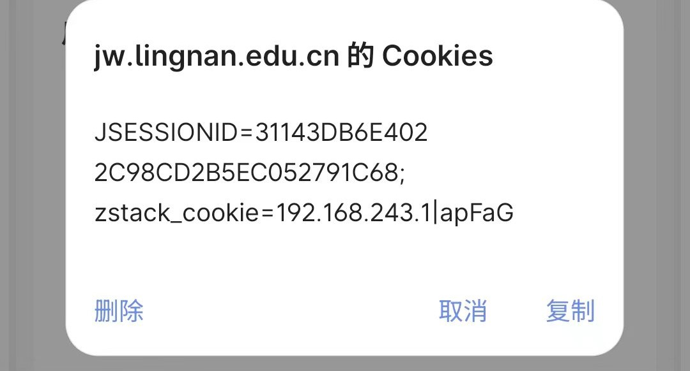

### 推荐优先使用Cookie作为登录方式

即便软件抢不到课，你也能正常通过浏览器完成正常的抢课，为自己多留后路

## 选课

非常建议直接使用精确教学班抢课

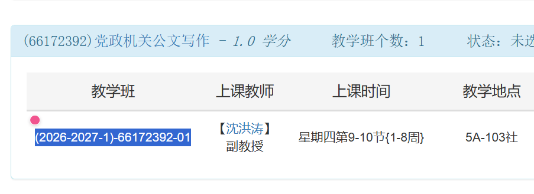

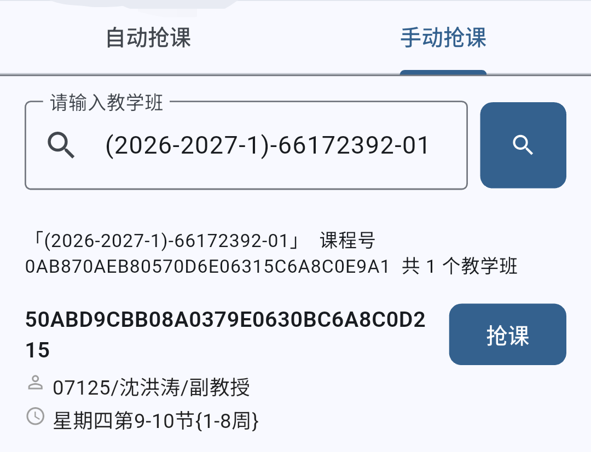

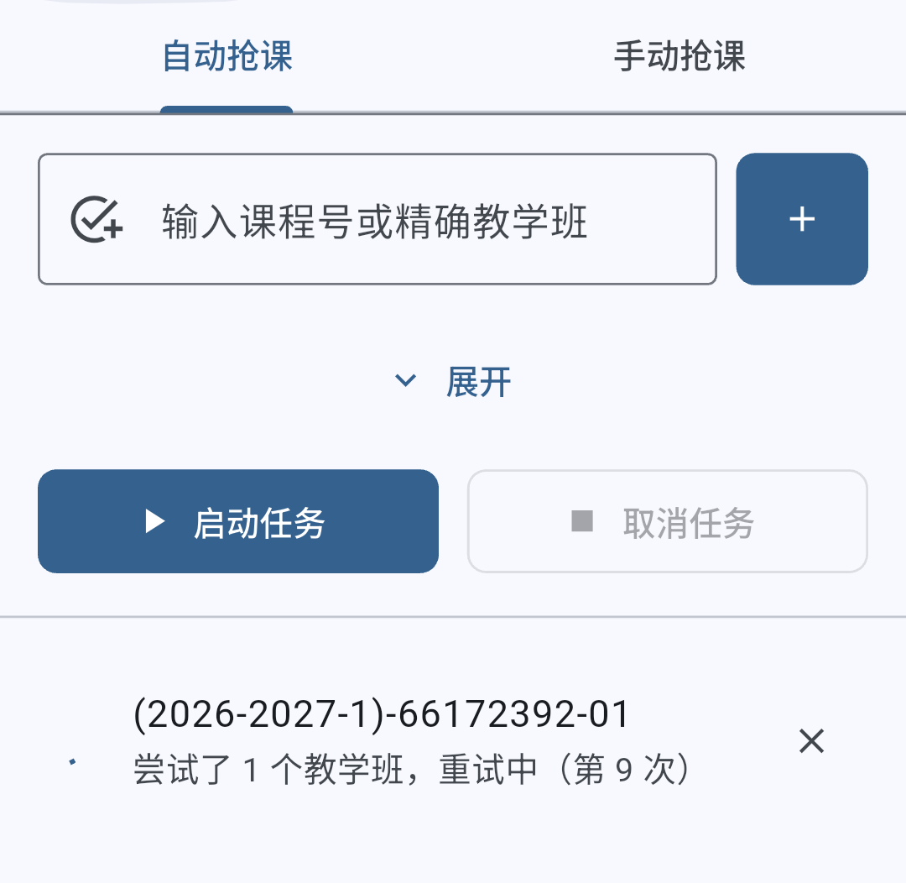

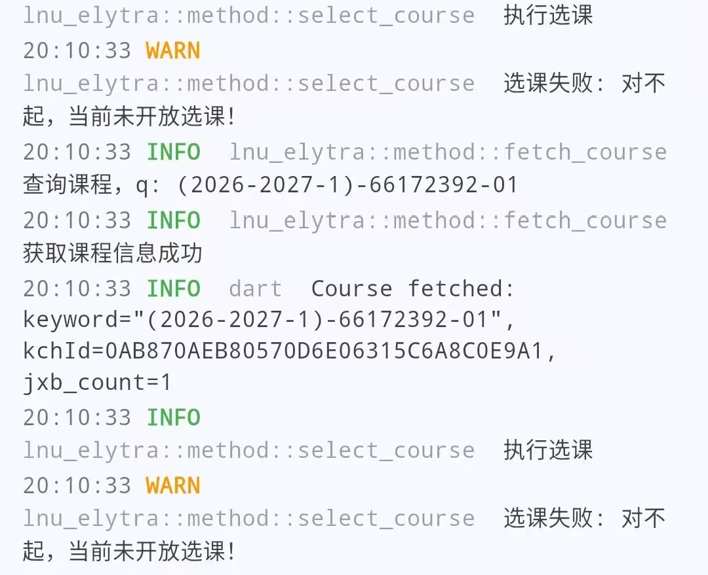

## 如何获得精确的教学班参数？

- 在抢课尚未开始的前一天，通常可以预览可选课程，这时候可以直接复制教学班为抢课做准备
- 留意官网选课公告，通常会将教学班在Execl中一同发出来

教学班示例：`(2025-2026-2)-77101504-02`

## 自动抢课

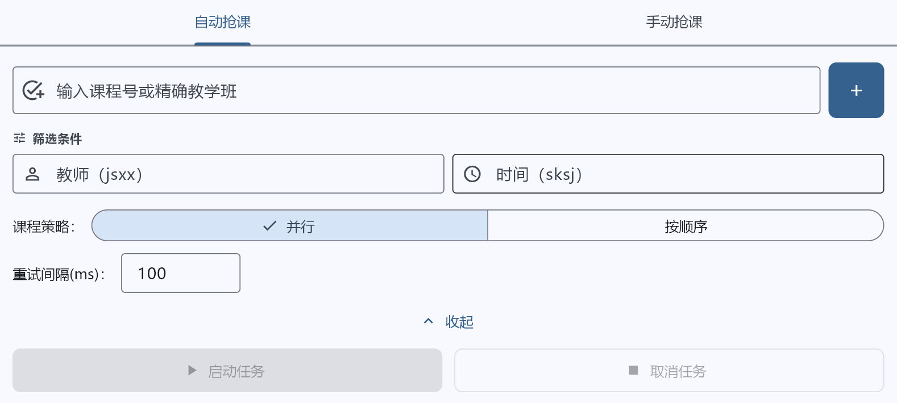

如果使用精确的教学班进行抢课，**无需**设置教师信息和上课时间的筛选条件，添加后并等差不多到正式抢课时间开始猛攻即可（如提前一分钟开启。

如果只使用课程号，或者课程名称作为关键字，建议设置教师信息和上课时间的筛选条件

设置教师信息和上课时间的筛选条件可以是完整信息的一部分，如教务系统上完整的显示为"45012/张三/讲师"，"星期四第9-10节{9-16周}"
你可以只设置

筛选教师： "张三"

筛选上课时间：

"9-10节"

"星期四"

"9-16周"

这样的作为筛选条件。

筛选条件需要以学校录入格式为准，如果不清楚自己学校的格式建议不要设置。

课程策略建议保持默认"并行"

## 手动抢课

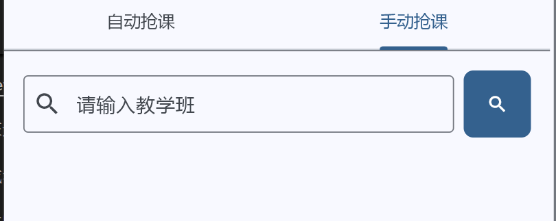

本质就是搜索，通常你也可以输入课程名称进行搜索，但越精确越好，因为只会显示教务系统搜索返回的第一个课程。

## 常见问题

## 要不要校园网？

如果学校教务系统本身可以公网访问（手机数据流量），则不需要校园网。如果不能公网访问（如岭南师范学院），则必须要连接校内的wifi.

但是可以不付费购买校园网，只连着wifi就行

不买校园网如何抢课:

1.关闭手机数据流量，关闭流量

2.只连接wifi，不需要认证登陆，只连着就行

3.访问教务系统ipv4地址，就能正常登录了。不需要**不需要**不需要**花钱**买校园网

访问地址：

```
http://202.192.143.203
```

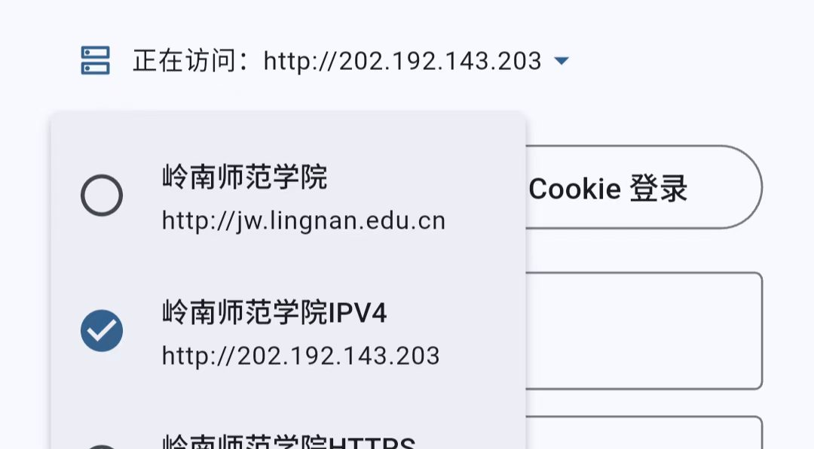

（在软件中设置自定义端点为这个就行了）

## 注意事项

如果教务系统有更新，抢课软件可能会失效，所以建议使用cookie登录，保证自己还能正常通过网页抢课。
