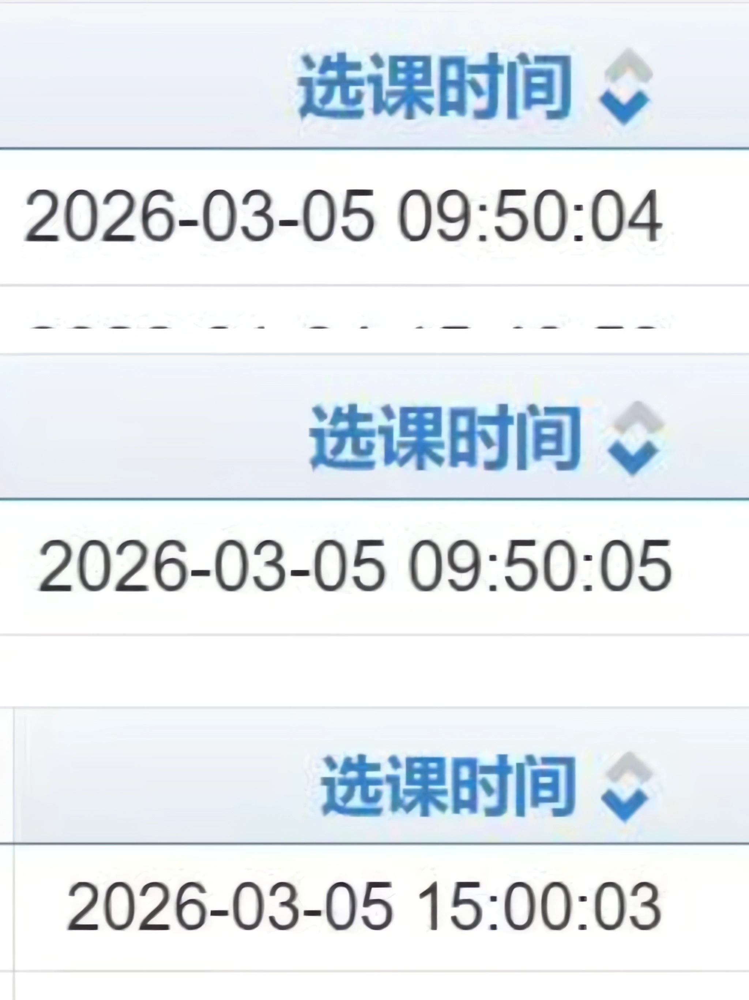

# lnuElytra 是什么?

[lnuElytra](https://github.com/mcitem/lnuElytra) 是适用于 [岭南师范学院正方教务系统](http://jw.lingnan.edu.cn) 的抢选课工具。（理论上相同版本的正方教务系统都能通用

由23级学长开发，经过多轮真实抢课测试，最快能3秒抢到课。现已临近毕业已经不再需要抢课，故免费开源供大家使用。

`lnuElytra` 基于Rust语言开发，并提供Python绑定以便普通用户使用。

如果需要同时为多个用户进行抢课，推荐使用Rust SDK进行编写。

- [Rust SDK 快速入门](./rust.md)

- [Python SDK 快速入门](./python.md)

- [API 参考](./interface.md)

## 战绩

### 2026年3月5日，[2024级体育选课](https://www.lingnan.edu.cn/content.jsp?urltype=news.NewsContentUrl&wbtreeid=1145&wbnewsid=322876)

> 上午 9:50 为寸金校区选课时间
>
> 下午 15:00 为湖光校区选课时间



## 抢课原理：为什么 `lnuElytra` 能这么快抢到课？

#### ~~史山教务系统~~

在你访问教务系统网页时时，你需要加载完网页上的所有资源，浏览器才允许你进行操作，否则就会表现为卡住动不了，包括但不限于

- `html` 网页本体
- `zftal-ui` 正方软件前端ui组件库
- `bootstrap` ui 库
- `jquery` dom 操作库
- `crypto/rsa` 加密库
- 其他字体、样式、logo图片等...

这需要几十个请求来完成

在抢课开始时，教务系统网关带宽根本供不起这么多人同时加载这些资源。

许多人就会卡在白屏页面上进不去系统，直到出现浏览器超时错误页面。

`lnuElytra` 通过选择性地只加载和抢课有关的必要资源，最小化请求资源的次数，就能实现以最快的速度选上课。

## 能否用于其他学校抢课？

具体能否使用请自测。理论上相同版本的正方教务系统都能使用

以下学校经过实测可用

- [广州商学院](http://jwxt.gcc.edu.cn/xtgl/login_slogin.html)

```rs
// 在 广州商学院 抢课（更换教务系统地址
let mut client = Client::new_with_base("http://jwxt.gcc.edu.cn".try_into()?);
```

## 免责声明

本工具仅供技术学习研究使用，不保证可用性、成功率，一切风险与后果由使用者自行承担。
